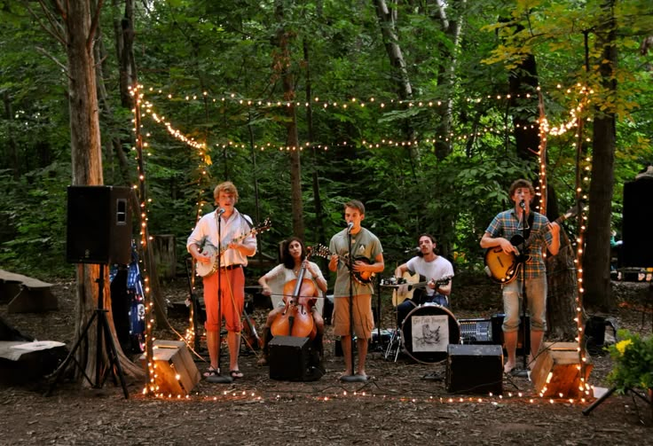
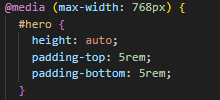
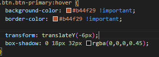
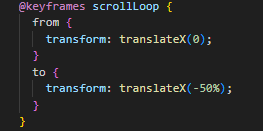
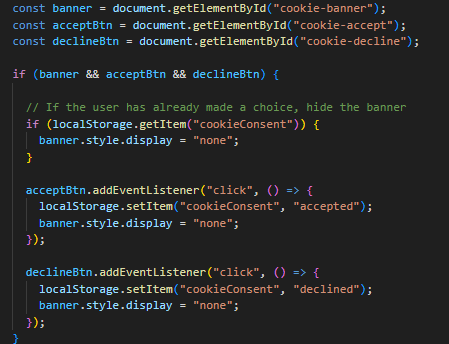

# The Rooting Table
### Technical Presentation

---

## Project Overview

A small recurring **Sunday event** built around food, music and presence.

- Offline & human-centered
- One landing page, not a platform
- Designed for slowness and continuity

---

---

## Mission

Creating a slow and welcoming Sunday experience.

- Bringing people together around one shared table
- Encouraging presence through food and live music
- Reducing digital distraction in social moments

---

## Vision

A different rhythm for social gatherings.

- Fewer events, more meaning
- Small-scale instead of mass formats
- Community built through repetition and care

---

## Values

Principles guiding design and technical choices.

- Slowness over efficiency
- Shared experience over individual consumption
- Listening over background noise

---

## Project Structure

The website is built as a **single-page layout** with anchor navigation.

- Continuous section-based navigation
- Clear section hierarchy
- Reduced cognitive load

*Hero · About · Experience · Sunday Plan · Location · Booking*

---

## Design & Responsiveness

The layout adapts without JavaScript frameworks.

- Bootstrap 5 grid system
- Flexbox for internal alignment
- Targeted media queries

Same content, adapted layout across devices.

---

## Hero Section

The hero required a mobile-specific adjustment.

- Desktop: full visual impact
- Mobile: content safety and readability

**Fix applied:**

- `height: auto`
- Custom vertical padding

---

---

## Call To Action Design

Buttons guide the entire interaction.

- Clear visual hierarchy
- Hover and tap feedback
- No JavaScript dependency

Primary actions stay visible and accessible.

---

---

## Image Gallery

A lightweight horizontal gallery communicates the atmosphere.

- Pure CSS animation
- Continuous loop
- Mobile height adjustment

Movement without overwhelming the layout.

---

---

## Navigation & JavaScript

Navigation relies on section-based anchors.

- Smooth scrolling
- Clear section IDs
- Visual feedback on scroll

---

---

## Lessons Learned

- Anchor links work well for long single-page layouts
- CSS-only carousels keep the interface lightweight
- Responsive design requires section-specific fixes

---

## Social Presence & Long-Term Plan

- Instagram for event updates and visual storytelling
- WhatsApp for direct communication and reminders
- Mailing list for recurring guests
- Ongoing collaboration with local musicians

---

## Future Improvements

Possible next steps for future iterations.

- Italian language version for local accessibility
- Structured lists for booking and musicians
- Clear ticket / access information

---

# See you on Sunday

*A slow table, every Sunday.*
